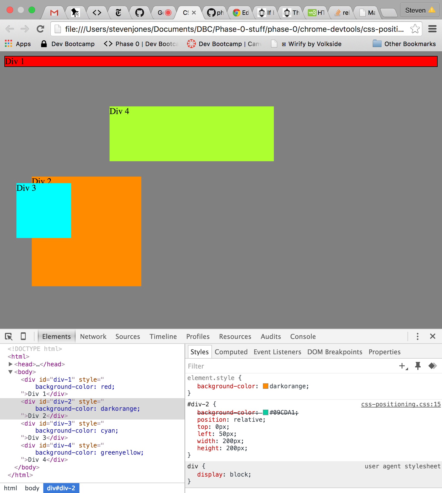
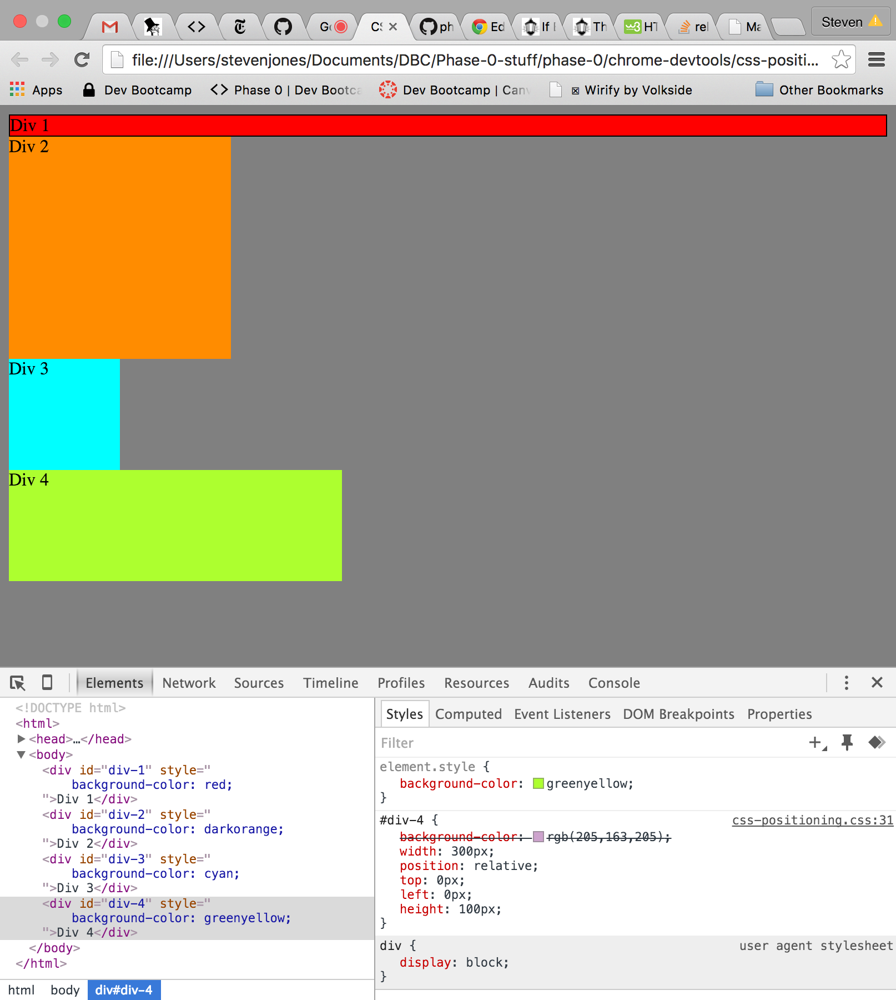
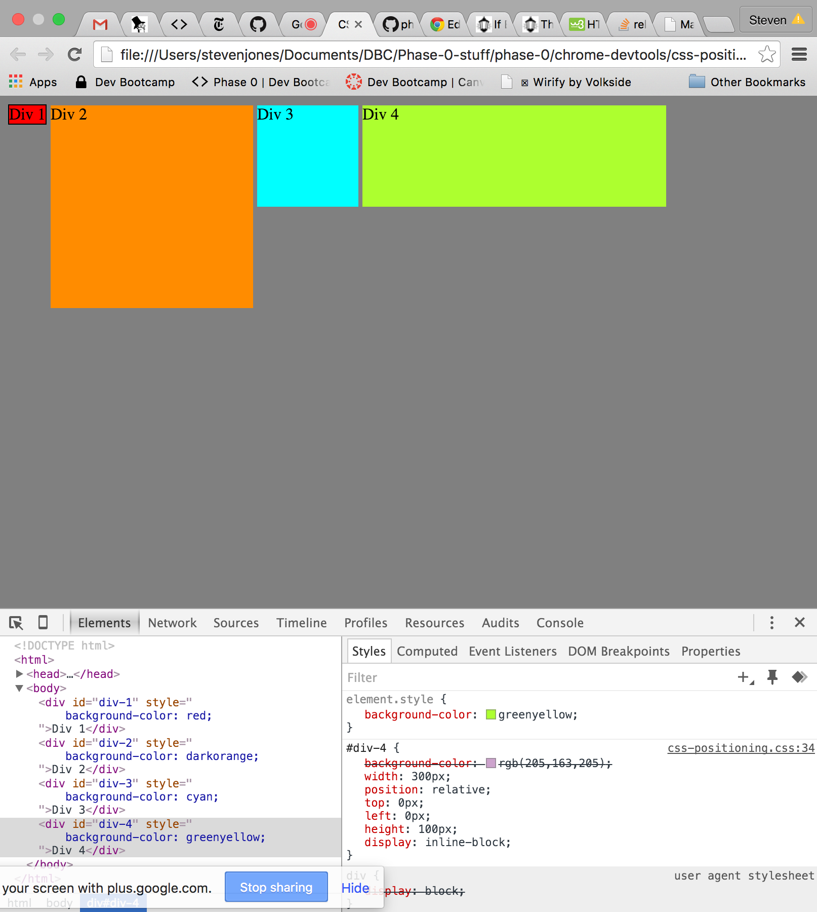
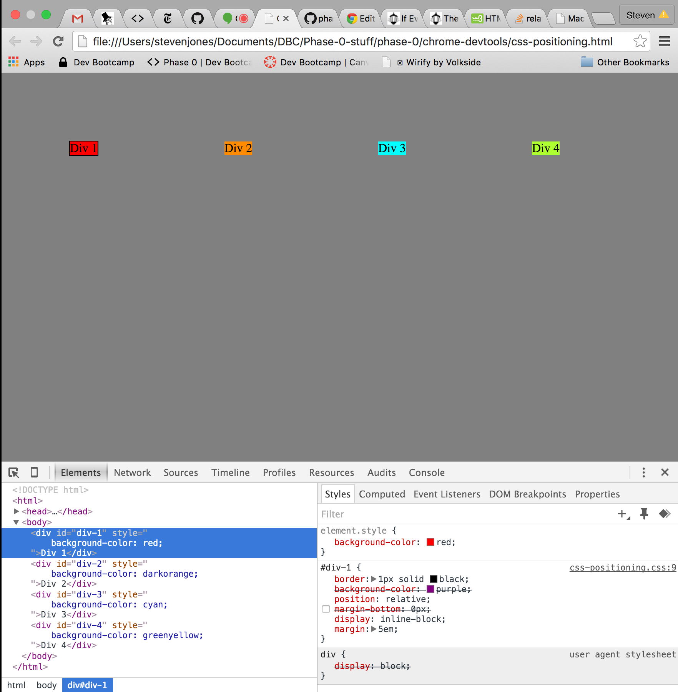
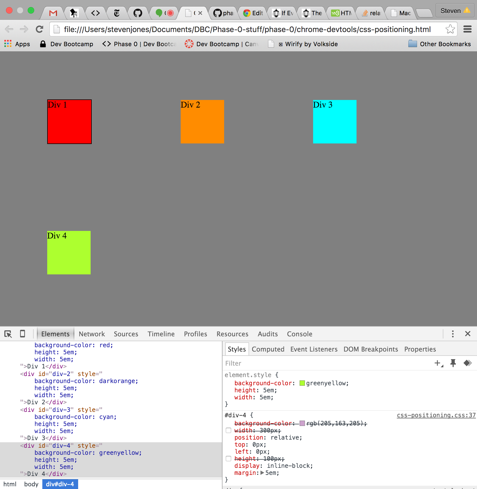
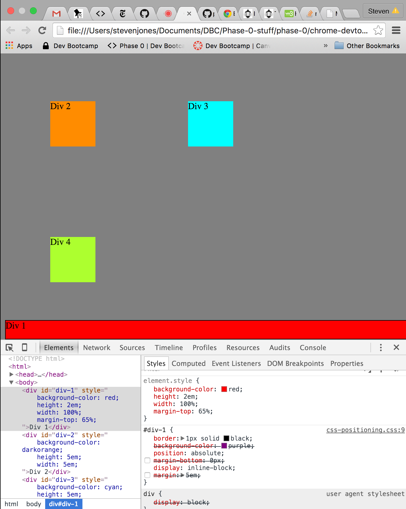
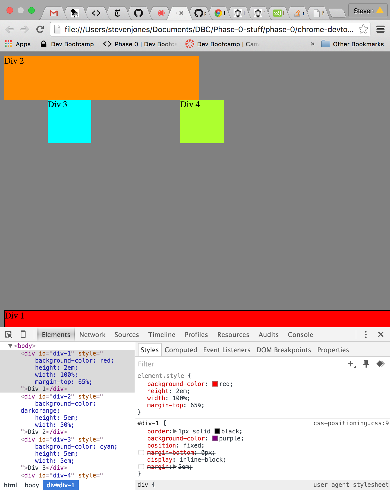
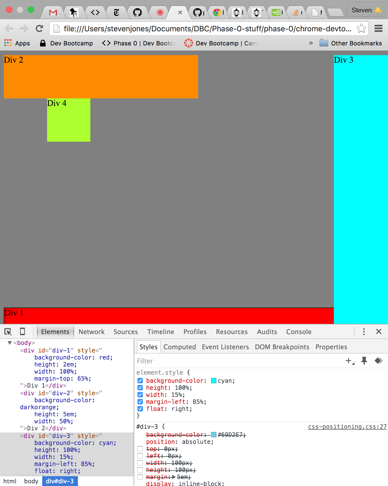
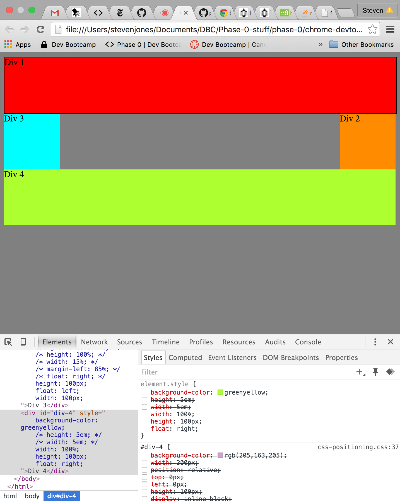

- Exercise 1: 
- Exercise 2: 
- Exercise 3: 
- Exercise 4: 
- Exercise 5: 
- Exercise 6: 
- Exercise 7: 
- Exercise 8: 
- Exercise 9: 

### How can you use Chrome's DevTools inspector to help you format or position elements?
DevTools helps you format and position elements by making it easy to navigate and edit html and css files side by side and by displaying properties and values in real time.

### How can you resize elements on the DOM using CSS?
You can resize elements by adjusting height, width, and padding values.

### What are the differences between absolute, fixed, static, and relative positioning? Which did you find easier to use? Which was the most difficult?

Absolute positioning takes objects out of the 'normal flow' so that they do not affect the placement of other objects on the page.

Static positioning is the default positioning setting. Static elements are positioned next to each other and do not overlap.

Relative positioning allows you to move elements relative to where they would have been in the normal flow - that is, relative to where they would have been in static positioning.

Fixed positioning literally fixes objects in their position so that as the user scrolls around the page, the objects stays in the same place on the screen.

I found relative positioning to be the most intuitive, but all of the positioning values make sense in the right context.

### What are the differences between margin, border, and padding?
In the box model of CSS elements, padding is the space around the content, the border is around the padding, and the margin is the space around the border.

### What was your impression of this challenge overall?
I learned a lot about Chrome DevTools by just diving in and experimenting with moving objects around the page. I look forward to getting more practice with DevTools.
